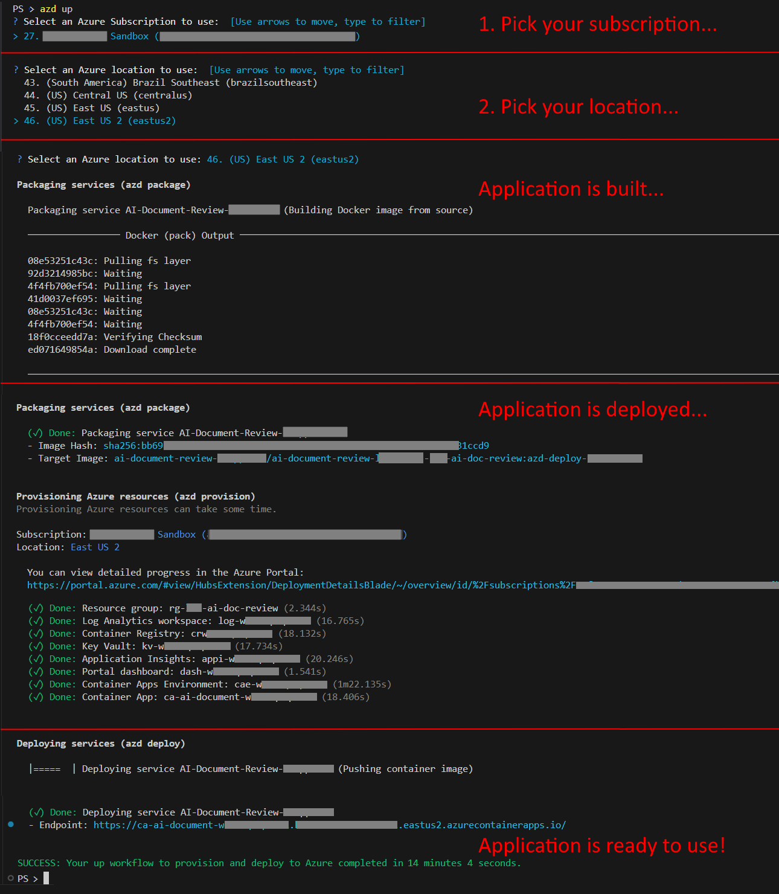
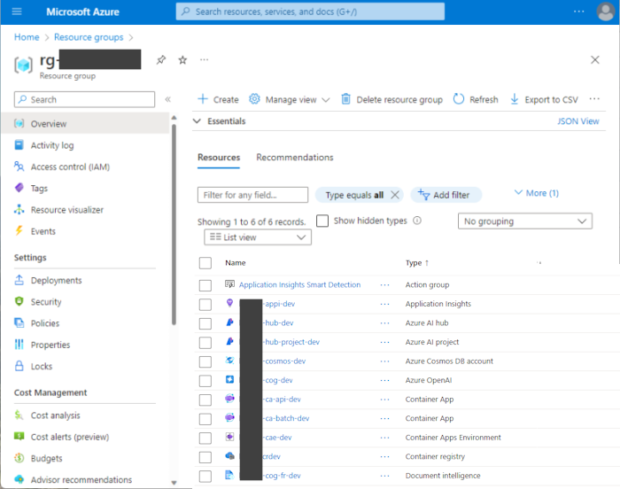

# AZD Command Line Deploy

The Azure Developer CLI (azd) is an open-source tool that accelerates the time it takes to get started on Azure. azd provides a set of developer-friendly commands that map to key stages in a workflow (code, build, deploy, monitor).

This project has been configured to work with AZD commands to make it fast and easy to deploy a demo.

---

## Special Configuration Instructions

Since this is a companion app  to the [SmartFlow API application](https://github.com/msft-mfg-ai/smart-flow-public), if you want to use `azd up`, you should use the same variables to match the existing SmartFlow API application.  Copy the AZD setting values from the Smart-Flow-Public project (i.e. the entire `.azure` folder), then add in the two variables `APP_NAME_NO_DASHES="xxxx"` and `ENVIRONMENT_NAME="dev"` and then the azd up command should work right off first time as designed.

## Configuration Secrets

This application requires a few secrets to be configured in the application before being deployed.

> *Note 1: these settings are stored in clear text in the .env file in the .azure/<yourEnvironment> directory. Be sure to edit the .azure/.gitignore file to exclude the <yourEnvironment> directory from being checked into source control!`*

> *Note 2: the first time you run the azd command, you will be prompted for the Environment Name, Azure Subscription and Azure Region to use -- see section below for information on choosing a good Environment Name.*

## Environment Names

When an AZD command is run for the first time, a prompt will ask for the "Environment Name", the Azure Subscription to use and the Azure Region to deploy to.

> *`NOTE: This "Environment Name" is NOT an environment code like [dev/qa/prod]!`*

Choose the "Environment Name" carefully, as it will be used as the basis to name all of the resources, so it must be unique. Use a naming convention like *[yourInitials]-[appName]* or *[yourOrganization]-[appName]* as the format for Environment Name. The resulting web application name `MUST` be globally unique.

For example, if Environment Name is equal to: 'xxx-chatgpt', AZD will create a Azure resources with these names:

| Azure Resource | Name                       | Uniqueness        |
| -------------- | -------------------------- | ----------------- |
| Resource Group |  rg-xxx-chatgpt            | in a subscription |
| Container App  |  xxxchatgpt-ca-api-azd     | global            |

Storage accounts and other resources will be named in a similarly fashion.

---

## AZD Commands

The five commands of most interest are:

- **azd up**: provisions Azure resources, builds app, and deploys it to Azure
- **azd provision**: provisions Azure resources but does not build and deploy the application
- **azd deploy**: builds the app and deploys it to existing Azure resources
- **azd down**: removes Azure resources create by this AZD command
- **azd env set**: sets an environment variable to be used by the main.bicep file

Typically a developer with either do the up command to do everything at once, or do the provision and deploy commands separately.

---

## Visual Studio Code

There is a Azure Developer CLI [extension](https://marketplace.visualstudio.com/items?itemName=ms-azuretools.azure-dev) available in Visual Studio Code. If that is installed, it is easy to pop up the command window like this:


---

## Command Line

These commands can also be run on the command line, like this:

```bash
> azd up
```

## Example Command Execution



### Resources Created



---

## Reference

[Azure Developer CLI Reference](https://learn.microsoft.com/en-us/azure/developer/azure-developer-cli/)

[Introducing the Azure Developer CLI - Azure SDK Blog](https://devblogs.microsoft.com/azure-sdk/introducing-the-azure-developer-cli-a-faster-way-to-build-apps-for-the-cloud/)

[Make your project compatible with Azure Developer CLI](https://learn.microsoft.com/en-us/azure/developer/azure-developer-cli/make-azd-compatible?pivots=azd-create)
